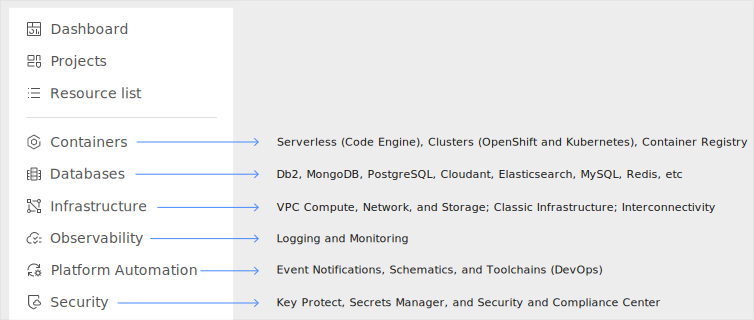

---

copyright:
  years: 2015, 2024
lastupdated: "2024-10-16"

keywords: ui, platform, console, using the console

subcollection: overview

---

{{site.data.keyword.attribute-definition-list}}

# Navigating the {{site.data.keyword.cloud_notm}} console
{: #ui}

The [{{site.data.keyword.cloud}} console](https://cloud.ibm.com){: external} is the user interface that you use to manage all your {{site.data.keyword.cloud_notm}} resources. You can create a free account, log in, access documentation, access the catalog, view pricing information, get support, or check the status of {{site.data.keyword.cloud_notm}} components. After you log in, the menu bar contains a **Navigation Menu** icon  and more links.
{: shortdesc}

## Using the console
{: #consoleoptions}

When you log in to {{site.data.keyword.cloud_notm}}, your dashboard is displayed, which shows widgets that summarize the status of your account. If you're interested in customizing your dashboard, see [Working with scoped dashboards](/docs/account?topic=account-custom-dashboard).

Use the following options to navigate to general areas of the console:

Browse available products
:   Use the **Catalog** link to explore over 350 products that offer options for compute, networking, security management, end-to-end developer solutions, and more. Use the tabs to filter the catalog to quickly access [deployable architectures](#x10293733){: term}, {{site.data.keyword.IBM_notm}} products, Cloud essentials, and more. 

Find help when you need it
:   Click the **Help** icon  > **Docs** to access the product documentation. 

Get support when something's not working as expected
:   Click the **Help** icon  > **Support center** to go to the [Support Center](https://cloud.ibm.com/unifiedsupport/supportcenter){: external} page.

Manage account preferences and more
:   From the **Manage** menu, you can access your account, billing and usage, and Identity and Access Management options.

Quickly access a browser-based shell environment
:   Click the **{{site.data.keyword.cloud-shell_notm}}** icon  to open a browser-based shell environment that you can use to work with your {{site.data.keyword.cloud_notm}} resources.

Estimate costs for your cloud deployments
:   Click the **Cost estimator** icon  to open the cost estimator.

Stay up to date with notifications
:   Click the **Notifications** icon  to view and control all incidents, maintenance, and announcements that are likely to affect your account.

Customize your profile and more
:   Click the **Avatar** icon  to access your profile, guided tours, console theme options, and more.

In addition to the console, [command-line interfaces (CLIs)](/docs/cli?topic=cli-getting-started), APIs, and SDKs are available for interacting with you cloud account and resources. [Terraform](/docs/ibm-cloud-provider-for-terraform?topic=ibm-cloud-provider-for-terraform-getting-started) support is also available through use of the {{site.data.keyword.cloud_notm}} Provider plug-in for managing cloud resources at enterprise scale through templates and scripting. 

## Can't find what you're looking for? 
{: #navoptions}

The {{site.data.keyword.cloud_notm}} platform recently consolidated services and features to provide you with a more simplified and customized experience. Services and areas of the console are now unified into six different hubs: Infrastructure, Containers, Automation, Databases, Observability, and Security. The goal of these changes is to bundle together related services to make it easier to find, deploy, and use them. Use our mapping and guidance to see what's changed in the {{site.data.keyword.cloud_notm}} catalog and console navigation to find what you're looking for. 

### Streamlined and dynamic {{site.data.keyword.cloud_notm}} catalog 
{: #catalog-changes-ps}

In addition to the new navigation changes, we updated the discoverability and management of our catalog. The new {{site.data.keyword.cloud_notm}} catalog makes it easy to discover {{site.data.keyword.IBM_notm}} products such as managed services, preconfigured software, professional services, and even partner services. You can navigate by using the new tabs in the catalog to explore what each category consists of. 

* Get your job done more efficiently with expertly-designed solutions. Cloud essentials is your main source for exploring related products that are tailored to specific industries in a cohesive way. 
* Use deployable architectures to understand how pre-built compositions of products work together to help solve common business problems. Deployable architectures accelerate your innovation and reduce risk across complex enterprise workloads. Industry solutions with configurations that previously took months to achieve are now available within hours.

### Simplified access to your workloads
{: #console-nav-ps}

{: caption="Updated navigation for the {{site.data.keyword.cloud_notm}} console" caption-side="bottom"}

From the **Navigation Menu** , you can access areas of {{site.data.keyword.cloud_notm}} that are focused on specific use cases and industries. Use the following options to explore the menu: 

Containers
:   The previous **Kubernetes**, **OpenShift**, **Code Engine**, and **Container Registry** menu options are now nested within **Containers**. 

Databases
:   All of your database needs are now centralized into one location. From **Databases**, you can create and manage relational databases ({{site.data.keyword.databases-for-mysql}}, Db2, {{site.data.keyword.databases-for-postgresql}}, and Databases for EDB); auxiliary databases ({{site.data.keyword.dashdbshort_notm}}, {{site.data.keyword.databases-for-etcd}}, and {{site.data.keyword.databases-for-redis}}); and non-relational databases ({{site.data.keyword.databases-for-elasticsearch}}, {{site.data.keyword.databases-for-mongodb}}, and {{site.data.keyword.cloudant}}). 

Infrastructure
:   The previous **Classic Infrastructure**, **VPC Infrastructure**, and **Interconnectivity** menu options are now nested within **Infrastructure**.

Observability
:   The **Observability** option still provides access to **Logging**, **Monitoring**, and **Activity tracking**. 

Platform Automation
:   The previous **DevOps** and **{{site.data.keyword.bpshort}}** options are now nested within **Platform Automation**, along with {{site.data.keyword.en_short}}.

Security
:   **{{site.data.keyword.compliance_short}}** is now integrated with {{site.data.keyword.keymanagementservicelong_notm}} and {{site.data.keyword.secrets-manager_short}} and can be accessed from the **Security** menu option. 
